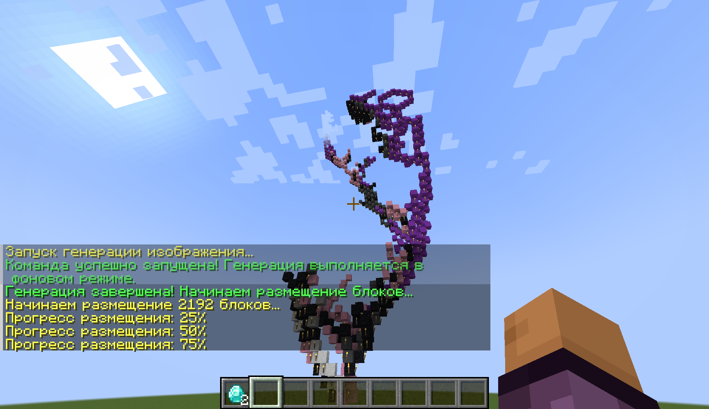

# Falling Block Art - Minecraft Generator

🎨 **Falling Block Generator for Minecraft** - a mod for creating artistic images from falling sand blocks in Minecraft using various height generation algorithms.


*Example of mod operation - creating an image from falling blocks*

## 📋 Description

This mod allows you to create beautiful artistic compositions from falling blocks in Minecraft. The mod analyzes images and creates three-dimensional structures using various height generation algorithms, turning ordinary images into structures made of sand blocks. When the first block is destroyed, the entire structure begins to fall, creating an amazing animation that gradually reveals the hidden image. Each block falls in the correct sequence, forming the original picture during the falling process.

## ✨ Features

- **Multiple height generation algorithms**: several different algorithms for creating unique structures
- **Asynchronous generation**: Does not block the server during creation of large images
- **Gradual block placement**: Blocks are placed gradually for better performance
- **Support for various formats**: PNG and JPG images
- **Color palette**: 16 concrete powder colors for accurate image reproduction
- **Interactive commands**: Simple command system with autocompletion

## 🚀 Installation

### Requirements
- Minecraft 1.19.3
- Fabric Loader 0.16.14+
- Fabric API 0.76.1+

### Installation steps
1. Install Fabric Loader for Minecraft 1.19.3
2. Download and install Fabric API
3. Place the mod JAR file in the `mods` folder
4. Launch Minecraft

## 📖 Usage

### Generation command
```
/image <width> <height> <algorithm> <file>
```

### Parameters
- **width** - image width in blocks (1-100)
- **height** - image height in blocks (1-100)
- **algorithm** - one of the available algorithms: `v1`, `v2`, `v3`, `v4`, `game`, `wave_noise`
- **file** - image filename from the `.minecraft` folder

### Command examples
```
/image 32 32 v1 my_image.png
/image 16 16 wave_noise landscape.jpg
/image 50 50 game portrait.png
```

### Image preparation
1. Place images in the `.minecraft` folder (Minecraft root folder)
2. Supported formats: PNG, JPG
3. It is recommended to use images with clear contrasts

## 📝 License

MIT License - see [LICENSE](LICENSE) file for details.

## 🤝 Contributing

Contributions are welcome! Please:
1. Fork the repository
2. Create a branch for the new feature
3. Make changes
4. Create a Pull Request
